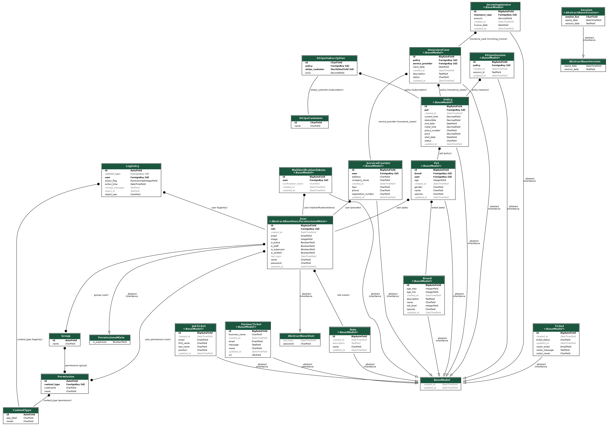

# Petoshield API

*Welcome to the Petoshield API, your gateway to seamless integration with our open-source pet insurance platform. 
The Petoshield API empowers developers to interact with our comprehensive pet insurance services programmatically. 
This documentation provides a detailed guide on how to utilize the API to manage pet insurance plans for cats and dogs.*

## Api Endpoints Example: [api.petoshield.com](https://api.petoshield.com) :link:


## :hammer_and_wrench: Get Started
- Clone Project
```bash
git clone https://github.com/vitaliisili/petoshield-rest.git
```

- Go to project folder
```bash
cd petoshield-rest 
```

- Create virtual environment
```Bash
python3 -m venv .venv  
```

- Activate virtual environment
```Bash
source .venv/bin/activate
```

> ### :grey_exclamation: **Note**
> - Next commands will be run with `make`. If make is not installed, just copy commands from `Makefile` 

> ### :warning: **Warning**
> - All commands with `make` must be run from root folder 
> - If you do not use `make` cd to folder `petoshield_api` and run commands manually there

- Create `.env` file
```Bash
make create-env
```
> ### **Note**
> - This will create `.env` file in `petoshield_api` folder fill all environment variable with valid data
> - You will need a smtp :incoming_envelope: for sending emails
> - You will need a stripe account to manage payments


- Install project dependency
```Bash
make install 
```

- Migrate Database
```Bash
make makemigration 
```

- Apply migration
```Bash
 make migrate
```

- Create `superuser`
```Bash
make createsuperuser
```

- Run server
```Bash
make runserver 
```

- Open the browser and go to [http://localhost:8000](http://localhost:8000)

## Postman Collections
- :closed_book: [Postman collection v2](../docs/postman_collection/Petoshield.postman_collection_v2.json)
- :blue_book: [Postman collection v2.1](../docs/postman_collection/Petoshield.postman_collection_v2.json)

## Database Diagram
- :file_cabinet: [Database diagram view](https://dbdocs.io/timur.v.shakirov/Petoshield-T)

## 	:card_index_dividers: Models Graph
