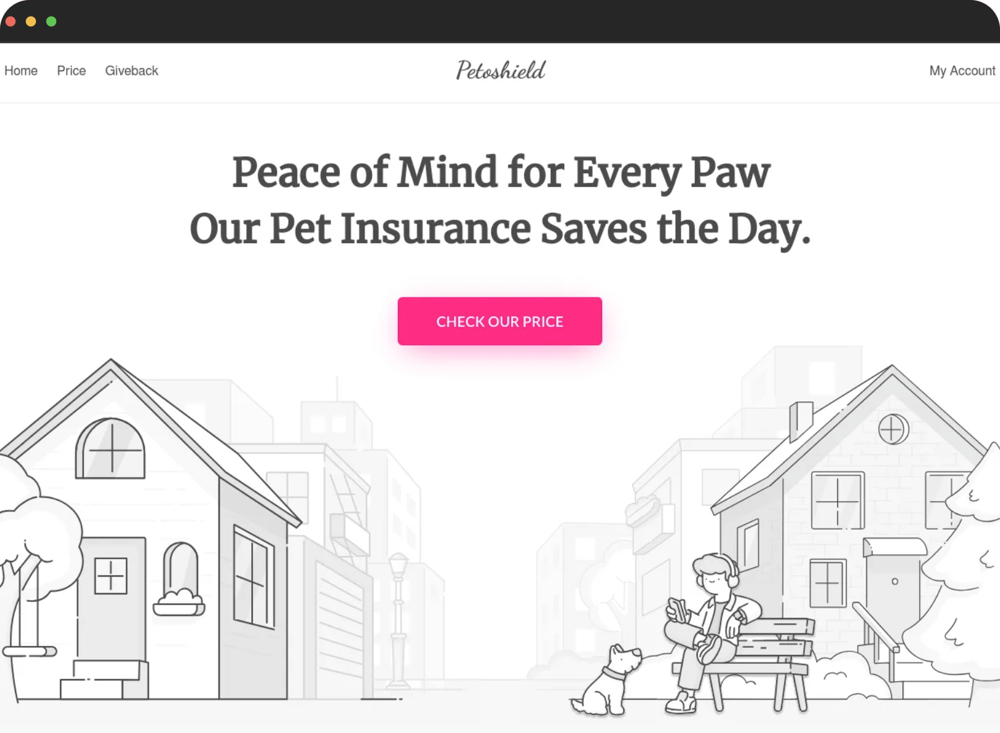

# Petoshield UI

*Petoshield is a comprehensive pet insurance application designed to cater to the unique needs of cat and dog owners. 
The UI is crafted using React.js for a seamless and interactive user experience, while Tailwind CSS ensures a modern 
and visually appealing design.*

### Petoshield UI example: [petoshield.com](https://petoshield.com) :link:
* * *



## :hammer_and_wrench: Get Started
>  ### :grey_exclamation: Note 
> - `Node js` must be installed
> - Run backend first look at :blue_book: [API Documentation](../petoshield_api/README.md) how to run
> - All commands will be run with `make` from project root folder
> - If `make` is not installed cd to folder `petoshield_ui` and run commands there. Copy command from `Makefile`

- Install all dependency
```bash
make install-web
```

- Create `.env` file
```Bash
make create-env-ui
```

- Run react application
```Bash
make start-web 
```

- Browser automatically will open [http://localhost:3000](http://localhost:3000) :link:

